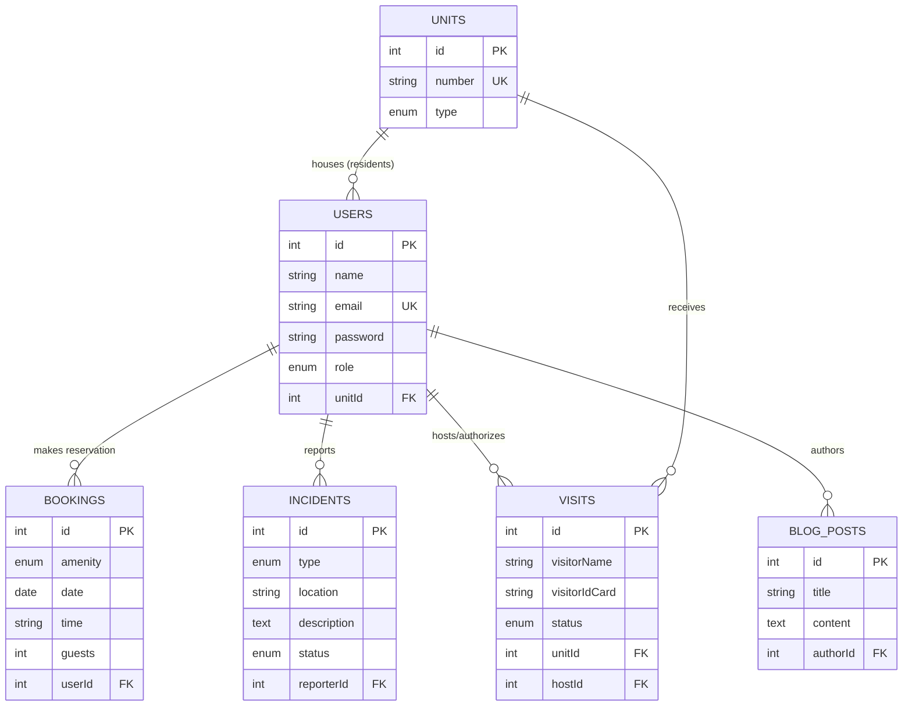

# Terrazas de Guacuco - Database Schema

## The 6 Core Tables

### 1. `Users` Table (The central hub for all accounts)
- **id** (Integer, Primary Key)
- **name** (String)
- **email** (String, Unique Index)
- **password** (String, Hashed)
- **role** (Enum: `superadmin`, `manager`, `watchman`, `lifeguard`, `resident`, `visitor`)
- **phone** (String, Nullable)
- **unitId** (Integer, Foreign Key -> `Units.id`, Nullable) — Identifies which specific unit a resident lives in. Visitors and staff typically have this set to Null.

### 2. `Units` Table (The physical properties in the complex)
- **id** (Integer, Primary Key)
- **number** (String, Unique) — e.g., "A-101"
- **type** (Enum: `1b1b`, `2b2b`, `townhouse`, `cabin`)
- **block** (String)

### 3. `Visits` Table (Security gate logs & Pre-registrations)
- **id** (Integer, Primary Key)
- **visitorName** (String)
- **visitorIdCard** (String)
- **plateNumber** (String, Nullable)
- **status** (Enum: `expected`, `entered`, `exited`)
- **exitTime** (DateTime, Nullable)
- **unitId** (Integer, Foreign Key -> `Units.id`) — Where they are going.
- **hostId** (Integer, Foreign Key -> `Users.id`) — Who authorized them.

### 4. `Incidents` Table (Maintenance & Security reports)
- **id** (Integer, Primary Key)
- **type** (Enum: `maintenance`, `security`, `noise`, `other`)
- **location** (String)
- **description** (Text)
- **status** (Enum: `open`, `in_progress`, `resolved`)
- **reporterId** (Integer, Foreign Key -> `Users.id`) — The resident or staff who reported it.

### 5. `Bookings` Table (Amenity reservations)
- **id** (Integer, Primary Key)
- **amenity** (Enum: `community_center`, `resort_pool`, `tennis_court`, `multi_purpose_facility`, etc.)
- **facilitySport** (String, Nullable) — e.g., 'Basketball' for multipurpose courts.
- **guests** (Integer)
- **date** (Date)
- **time** (String)
- **userId** (Integer, Foreign Key -> `Users.id`) — The resident who made the booking.

### 6. `BlogPosts` Table (Community news/bulletin board)
- **id** (Integer, Primary Key)
- **title** (String)
- **content** (Text)
- **imageUrl** (String, Nullable)
- **authorId** (Integer, Foreign Key -> `Users.id`) — The Admin/Manager who wrote the post.

---

## Entity-Relationship Diagram

---

## Important Database Concepts Used Here:

1. **Primary Keys (PK):** Every single table has an `id`. This is a unique, auto-incrementing number that guarantees no two records are exactly the same.
2. **Foreign Keys (FK) & Normalization:**
   - Instead of duplicating string data, tables reference other tables via `id`s (e.g., `userId`). This saves space, ensures accuracy, and updates cascade naturally.
3. **One-to-Many Relationships (1:N):**
   - ONE `Unit` can house MANY `Users` (Residents). ONE `User` can report MANY `Incidents`.
4. **Enums (Enumerations):**
   - Restricting a database column to a strict list of allowed words. This guarantees database integrity by stopping invalid entries.
5. **Unique Constraints (UK):**
   - Enforcing that no two rows can have the same value in a specific column (e.g., no two users can share the same exact `email`).
